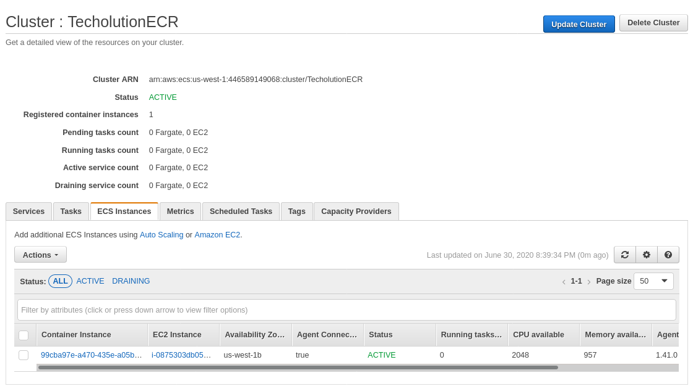
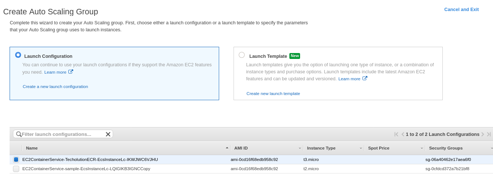
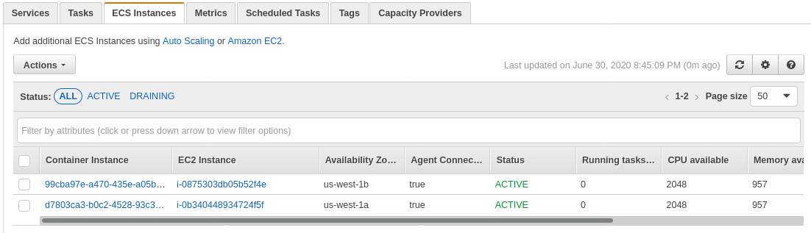
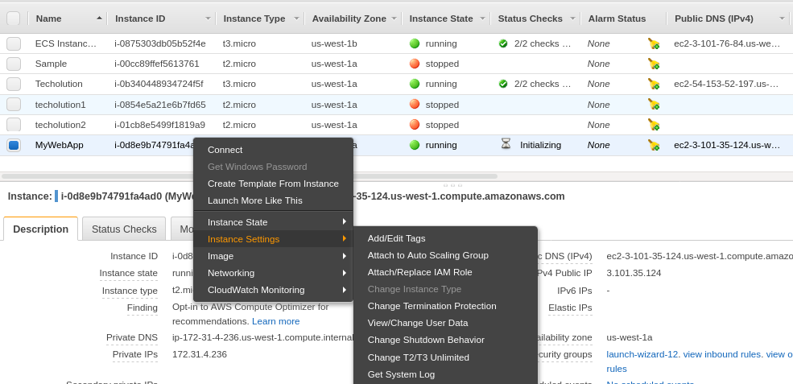
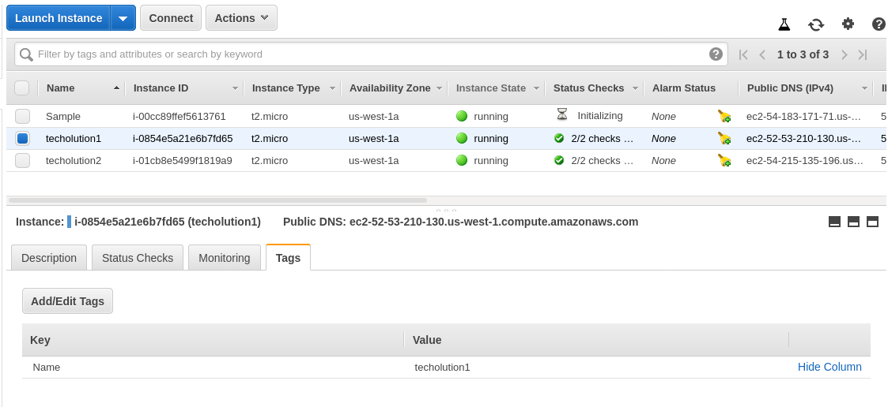
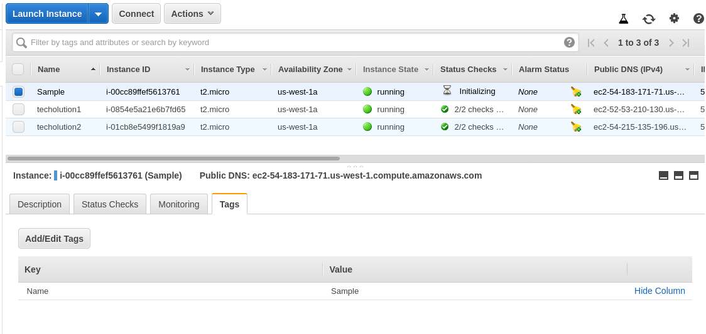
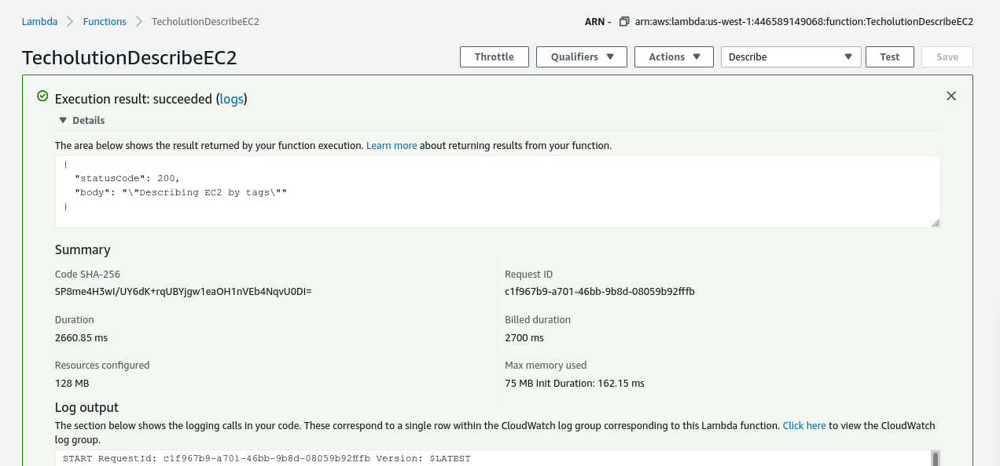
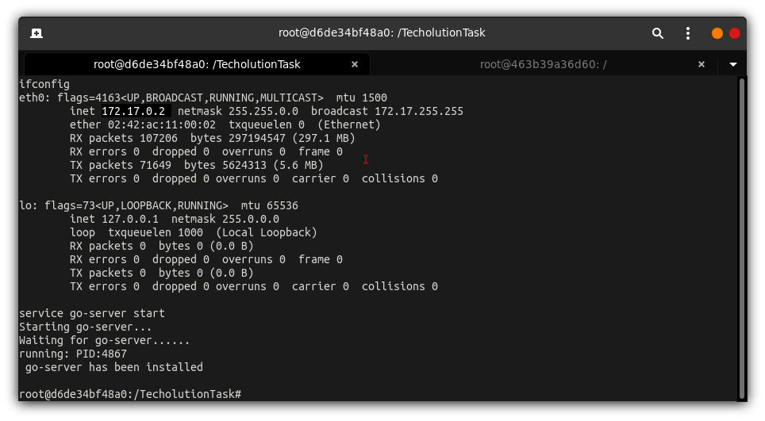
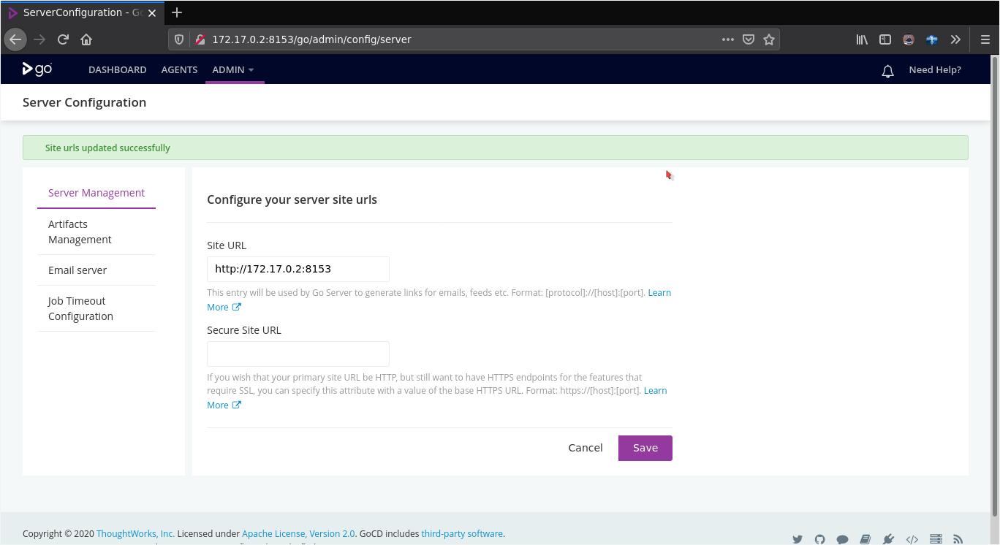
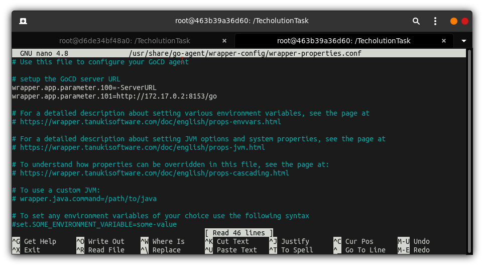

# AWS DevOps Internship from 'Techolution'.

Assignment assigned by **Mr.Madhav Rao, Lead Talent Acquisition Specialist,Techolution.**

_Tasks:_

> **AWS:** [SubTask-01](#subtask-01) | [SubTask-02](#subtask-02) || **GoCD:** [SubTask-a](#subtask-a) | [SubTask-b](#subtask-b)

## AWS:

 ### SubTask-01: 
 _Create an ECS cluster and register the underlying ec2 instance to that newly created cluster with the help of AWS launch configuration and auto scaling group._
- Approach:
  1. Starting with creating an ECS cluster which is shown in the below image.
   
   > Here it could be observed that, there is a single ec2 instance linked up with the TecholutionECR (Should be ECS).
  2. I'm proceeding by using the `Add additional ECS instances` option available just above the listing. I will copy the configuration of ECS AutoScalling Group and use it to add another AutoScalling group as shown in image.
   
  

  3. Here, In the below image it can be seen that we have an additional ECS instance listed below in the ECS instances listing.

  

  > This is the required solution.

   4. It could be seen that, we might arrive at a scenario where in an EC2 machine (pre-existing) needs now to be clusterized, A simple step that could be used to acheive this could be: adding the EC2 instance to our new/original AutoScalling Group.
  
   

   > In the above image, `MyWebApp` is being attached to our AutoScalling Group and inturn to our ECS Cluster.

[Return.](#aws)

 ### SubTask-02:
_Create an AWS lambda function using any language or approach which will only describe the specific ec2 instances based on the given tag._  

- Approach: 
  1. I'm starting with 3 EC2 instances (@ us-west-1), I have used `Name` tag for three of them, whose value is `Techolution1, Techolution2 & Sample` respectively as seen in the image below.
   
  
   
   

  2. I've created a Lambda Function 'TecholutionDescribeEC2' and defined the code as follows.

```
    import json
    import boto3

    def lambda_handler(event, context):
        ec2 = boto3.resource('ec2')
        tag = 'Name'
        value = 'techolution*'
        print ('\n')
        instances = ec2.instances.filter(
        Filters=[{'Name': 'tag:' + tag, 'Values': [value]}])
        for instance in instances:
            print ('Instance ID : ', instance.id)
            print ('Instance State : ', instance.state['Name'])
            print ('Instance Type : ', instance.instance_type)
            print ('AWS_ImageID : ',instance.image_id)
            print ('Public DNS : ', instance.public_dns_name)
            print ('VPC & subnet : ', instance.vpc_id , instance.subnet)
            print ('\n')
        
        return {
            'statusCode': 200,
            'body': json.dumps('Describing EC2 by tags')
        }
```
> _In the above code, the value of `value` is assigned as `techolution*` which displays everything with `techolution` keyword and whatever the characters followed by it._

> _Modifying `techolution*` with `*` would output the three EC2 instances._

>Results:

```
Response:
{
  "statusCode": 200,
  "body": "\"Describing EC2 by tags\""
}

Request ID:
"c1f967b9-a701-46bb-9b8d-08059b92fffb"

Function Logs:
START RequestId: c1f967b9-a701-46bb-9b8d-08059b92fffb Version: $LATEST


Instance ID :  i-0854e5a21e6b7fd65
Instance State :  running
Instance Type :  t2.micro
AWS_ImageID :  ami-0d705db840ec5f0c5
Public DNS :  ec2-52-53-210-130.us-west-1.compute.amazonaws.com
VPC & subnet :  vpc-c58a64a3 ec2.Subnet(id='subnet-94af5ace')


Instance ID :  i-01cb8e5499f1819a9
Instance State :  running
Instance Type :  t2.micro
AWS_ImageID :  ami-0d705db840ec5f0c5
Public DNS :  ec2-54-215-135-196.us-west-1.compute.amazonaws.com
VPC & subnet :  vpc-c58a64a3 ec2.Subnet(id='subnet-94af5ace')


END RequestId: c1f967b9-a701-46bb-9b8d-08059b92fffb
REPORT RequestId: c1f967b9-a701-46bb-9b8d-08059b92fffb	Duration: 2660.85 ms	Billed Duration: 2700 ms	Memory Size: 128 MB	Max Memory Used: 75 MB	Init Duration: 162.15 ms	

```



---

## GoCD:

### SubTask-a:

_Install and configure the GoCD server on linux box._

- Approach:
  
  1. Installing GoCD can be listed as a mundane task. It involves two basic steps, installing server and then agent. They must be further linked. Steps for this could be found [here](https://docs.gocd.org/current/installation/install/server/linux.html).
  
  2. I have automated this procedure for both server and agent using bashscripts and makefiles. This could be simply run on `Debian` using:

```
git clone https://github.com/KR-Ravindra/TecholutionTask.git
cd TecholutionTask
chmod +x get-started.sh
./get-started.sh
```
> Make sure to run the above as `superuser` or with `sudo` priviliges.

>Server:



>Agent:


[Return.](#aws)

### SubTask-b:


 


